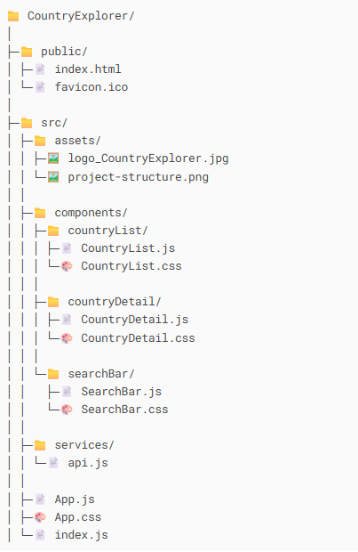

# Country Explorer
Country Explorer is a responsive, single-page React application that allows users to explore countries from around the world using data from the REST Countries API. Users can view details about each country and search by name interactively.

## Features

### List of Countries

- Fetches all countries from `https://restcountries.com/v3.1/all`
- Displays each country as a card with:
  - Official Name
  - Flag
  - Region
  - Population

### Search Functionality

- Search by official country name via `https://restcountries.com/v3.1/name/{name}`
- Dynamically filters the list as you type

### Country Detail View

Clicking on a country card reveals a detailed view (in a modal) with:
- Official and Common Name
- Flag
- Capital
- Region and Subregion
- Population
- Languages
- Currencies
- Border Countries (resolved by name)

### Responsive Design

- Optimized layout for desktop, tablet, and mobile devices using Bootstrap and custom styles
- Ensures usability across various screen sizes

## Styling
This project uses React Bootstrap for UI layout and components, combined with custom CSS for styling adjustments:
   - Custom CSS using *.css files for component-level styling
   - React Bootstrap for layout and built-in components (Alert, Modal, Button)
   - Header with background image

Note: To ensure visual consistency and prevent style conflicts with Bootstrap's default styles, !important has been used in custom CSS rules. This was a temporary measure during initial integration with Bootstrap.

Why !important was used:
   - Override specificity of Bootstrap's predefined classes.
   - Ensure consistent styles across all components (e.g., button radius, input border, font colors).
   - Accelerate the UI development process during early stages.

## Technologies Used

- **React**: JavaScript library for building user interfaces.
- **Bootstrap**: Frontend framework for responsive design.
- **REST Countries API**: API used to fetch country information.

## Project Structure

## Known Issues / Future Work
   - Refactor styles to minimize reliance on !important
   - Improve mobile responsiveness for modals
   - Add support for multi-field search (e.g., region or capital)
   - Add language support

## Do you want to test the App without installing anything?

   - Go to: https://country-explorer-jasch.web.app/

## How to Run the App locally on PC, Phone, or Tablet 

### On PC 

1. **Install Git**  
   - Download, install and configures Git from: [https://git-scm.com/downloads](https://git-scm.com/downloads)

2. **Install Node.js and npm**  
   - Download and install Node.js (includes npm) from: [https://nodejs.org](https://nodejs.org)

3. **Clone the repository**  
   - Create a folder called, for example, Country Explore
   - Open a terminal in Country Explore path or right click and 'open a git bash here' if git is installed
   - Execute this command: git clone https://github.com/JASCH97/country-explorer.git
   - Execute this command: cd country-explorer

4. **Install dependencies**  
   - npm install

5. **Run the development Server** 
   - npm start

6. **Open in your browser**  
   - Visit: http://localhost:3000

### On Phone or Tablet (Using Local Network)

1. **Follow steps 1 to 3 in How to Run in PC**  

2. **Make sure your PC and mobile device are on the same Wi-Fi network**  

3. **Find your PC’s local IP address**  
   - On Windows open Command Prompt and execute this command: ipconfig
   - On macOS/Linux run ifconfig or execute this command in Terminal: ip

4. **Start the development server with network access enabled**  
   - Execute this command: npm start -- --host

5. **Access from your phone or tablet**  
   - http://<your-pc-ip>:3000
   - Example: http://192.168.0.104:3000

## Evaluation Criteria

- Correct consumption of the REST API.
- Good programming practices (structure, components, reusability).
- Clean and commented code.
- Correct handling of load states, error and empty results.
- Clear and tidy visual presentation (advanced graphic creativity will not be evaluated, only usability).

## External Resources Used

   - https://getbootstrap.com/docs/4.1/getting-started/introduction/
   - https://www.react-bootstrap.cn/docs/getting-started/introduction
   - https://jsdoc.app/ 
   - https://precodes.hashnode.dev/jsdoc-the-ultimate-guide-to-documenting-your-javascript-code
   - https://developer.mozilla.org/en-US/docs/Web/API/Fetch_API/Using_Fetch
   - https://blog.stackademic.com/fetch-api-do-you-really-know-how-to-handle-errors-b06359e47a0a
   - https://react-icons.github.io/react-icons/

